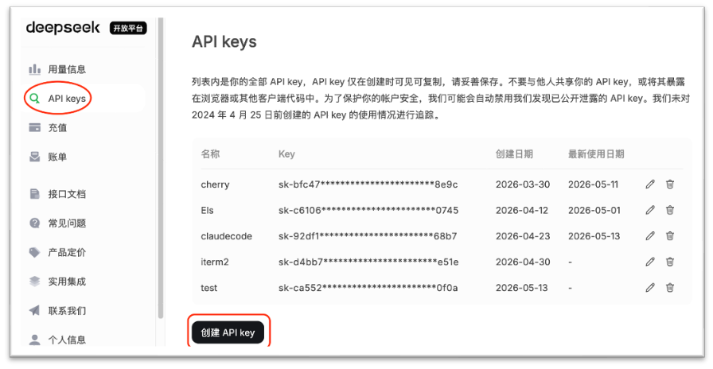

# 安装与配置

## 获取 DeepSeek API key

前往 [DeepSeek 开放平台](https://platform.deepseek.com)，登录、实名认证、充值后，创建 `API_KEY`，复制供后续配置。



选择 DeepSeek 而非 Anthropic 原生 API 的原因：

- **可及性**：Anthropic API 需海外信用卡和美元结算，国内获取不便；DeepSeek 开放平台支持人民币充值，无需代理即可访问
- **协议兼容**：DeepSeek 兼容 Anthropic Messages API 协议，Claude Code 仅需修改 `ANTHROPIC_BASE_URL` 即可接入
- **Agent 能力**：DeepSeek V4-Pro 在 Agentic Coding 评测中居开源模型第一（2026年4月），已深度适配 Claude Code，百万 Token 上下文满足大型代码库需求
- **成本**：API 定价约为同性能 Anthropic 模型的数分之一

## 安装 Claude Code

按 `Win⊞` 键，输入 `powershell` ，输入以下命令以安装 Claude Code：

```powershell
# 安装 Claude Code
winget install Anthropic.ClaudeCode --accept-source-agreements
# 安装 Git
winget install Git.Git --accept-source-agreements
```

> 如果 winget 下载太慢，参考 [附录 E 常见问题 #2](./07-appendix.md#附录-e常见问题-faq)

配置接入 `DeepSeek` ：

```powershell
# 填入 DeepSeek_API_KEY
$env:DEEPSEEK_API_KEY='实际API_KEY'
[Environment]::SetEnvironmentVariable("DEEPSEEK_API_KEY", $env:DEEPSEEK_API_KEY, "User")

# 创建配置文件 ~/.claude.json 以跳过登录
@{ hasCompletedOnboarding = $true } | ConvertTo-Json | Out-File $env:USERPROFILE\.claude.json -Encoding UTF8
# 创建配置文件 ~/.claude/settings.json
New-Item -ItemType Directory -Force -Path $env:USERPROFILE\.claude
@{
    env = @{
        ANTHROPIC_AUTH_TOKEN = $env:DEEPSEEK_API_KEY
        ANTHROPIC_BASE_URL = "https://api.deepseek.com/anthropic"
        ANTHROPIC_MODEL = "deepseek-v4-pro[1m]"
        ANTHROPIC_DEFAULT_HAIKU_MODEL = "deepseek-v4-flash"
        ANTHROPIC_DEFAULT_SONNET_MODEL = "deepseek-v4-pro"
        ANTHROPIC_DEFAULT_OPUS_MODEL = "deepseek-v4-pro"
        CLAUDE_CODE_SUBAGENT_MODEL = "deepseek-v4-pro"
        CLAUDE_CODE_DISABLE_NONESSENTIAL_TRAFFIC = "1"
        CLAUDE_CODE_DISABLE_NONSTREAMING_FALLBACK = "1"
        CLAUDE_CODE_EFFORT_LEVEL = "max"
    }
} | ConvertTo-Json | Out-File $env:USERPROFILE\.claude\settings.json -Encoding UTF8
```

> Mac/Linux 用户请参考 [附录 F](./07-appendix.md#附录-fmaclinux-用户提示)。

## 验证安装

重新打开终端后，输入以下命令确认安装成功：

```powershell
claude --version
```

如显示版本号（例如 `2.1.116 (Claude Code)`），说明安装和配置已就绪。

关闭当前窗口重新打开，可直接启动 `claude` ：

```powershell
claude
```

如需更新软件，只需执行：

```powershell
# 更新
winget upgrade Anthropic.ClaudeCode
```

（可选）安装其他常用软件：

```powershell
# 安装 Python 3.12
winget install Python.Python.3.12 --accept-source-agreements
# 或安装 Conda
winget install CondaForge.Miniforge --accept-source-agreements
# 安装 Visual Studio Code
winget install Microsoft.VisualStudioCode --accept-source-agreements
# 安装 npm
winget install OpenJS.NodeJS.LTS --accept-source-agreements
```

## Visual Studio Code 集成

在 Visual Studio Code 中安装 `Claude Code for VS Code` 扩展插件，即可在编辑器内以 `GUI` 或 `CLI` 方式使用 Claude Code。另外，安装  `Chinese (Simplified) (简体中文) Language Pack for Visual Studio Code` 插件，可将界面语言改为简体中文。


安装后，VSCode 左侧会出现 Claude Code 面板，右上角会出现 Claude 图标，可以直接在编辑器中与 AI 对话、让 AI 读写项目文件。支持在文件上 `@` 引用、`/plan` 模式等完整功能。
按 `Ctrl + Shift + P` 打开命令面板， `Shell 命令: 在 PATH 中安装“code”命令` 后，可实现两个软件的联动。

在 VSCode 左下角打开设置，勾选 `Claude Code: Use Terminal` ，可默认使用 CLI 版本的 Claude Code，功能更全更灵活。