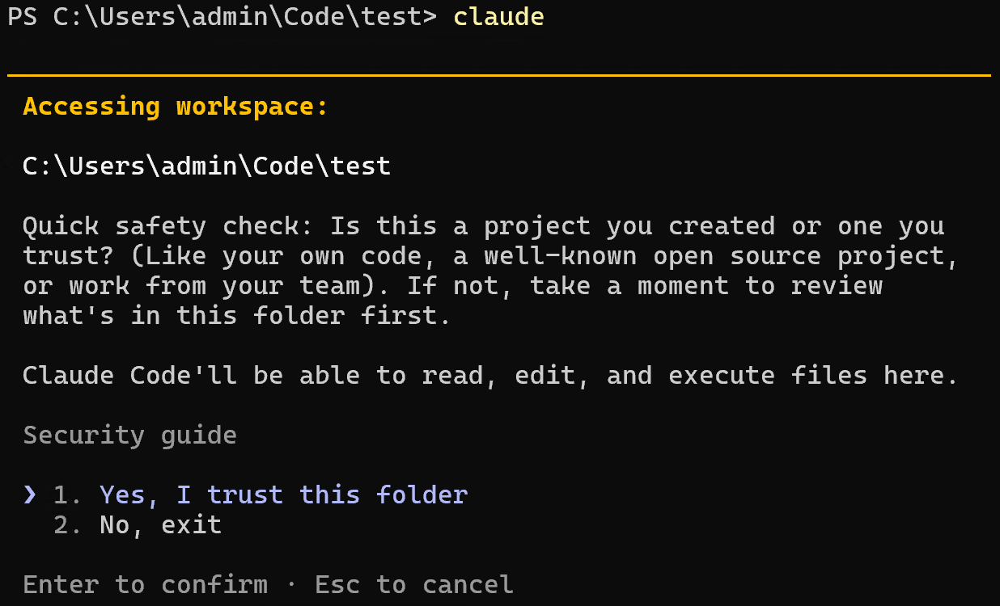
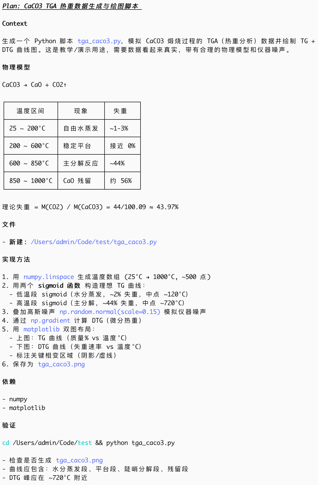
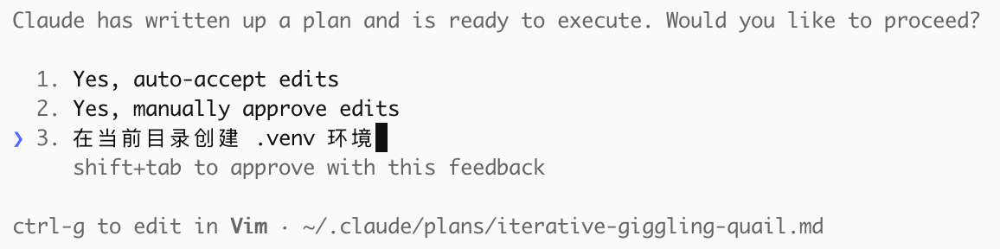
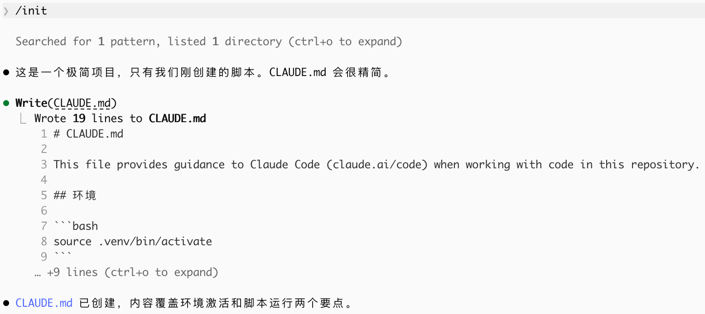

# 基础使用

进入项目目录，启动 `claude`。

出于安全考虑，需确认是否信任该目录。输入 `1` 或者敲 `Enter⏎` 以信任。



让它执行一段简单的任务

```text
/plan 生成一份python脚本，生成随机的CaCO3煅烧过程的TGA热重数据，并绘制曲线图。
```



AI 将生成完整的计划，包括任务、物理模型、架构和方法、结果验证。如果计划有所不足，可以告知 AI 进行修改；也可以按 `Ctrl⌃ + G` 手动编辑计划。



> **提示**：如果 `/plan` 执行中报认证错误（如 `401 Unauthorized`），说明 API Key 未正确配置。请检查 `~/.claude/settings.json` 中的 `ANTHROPIC_AUTH_TOKEN` 是否正确填入。其他常见问题见 [附录 E：常见问题 FAQ](./07-appendix.md#附录-e常见问题-faq)。

用 `/init` 让 Claude 扫描整个项目，生成 `CLAUDE.md` 文件，便于新的 Agent 快速了解整个项目。



## 写一个好的 Prompt

模糊的提示可能有效，但通常会花更多时间引导。

```text
什么文件 → 什么变量/什么列 → 做什么分析 → 输出什么格式 → 存到哪里
```

**坏例子**：
> "帮我分析一下数据"

**好例子**：
> "读取 @data/TGA_raw.csv。画 TG(%) 和 DTG 随温度 T(K) 的变化曲线。TG 用左轴，DTG 用右轴。配色 viridis，线宽 2。保存到 figures/TGA_DTG.pdf。"

**几个原则**：
1. **分步给任务** — 先让 AI 看数据结构，确认理解正确，再逐步加分析需求。
2. **用例子说明期望** — 与其说"画好看点"，不如说"参考这篇论文 Fig.3 的风格，配色用 `viridis`"
3. **让 AI 验证自己** — 生成代码后追加一句"解释一下这段代码的核心逻辑，有没有需要注意的数值问题"

[附录 C](./07-appendix.md#附录-c提高-prompt-质量) 中提供了如何提高 Prompt 质量的一些例子。

**迭代式工作流** — 不要期待一次 Prompt 出完美结果：
1. 第一轮给粗需求，观察 AI 理解了什么、方向对不对
2. 第二轮纠正偏差，细化需求（"阈值调小 5%"、"使用区分度更大的配色"）
3. 第三轮调试优化（"高转化率段的数据波动太大，加个平滑"）
