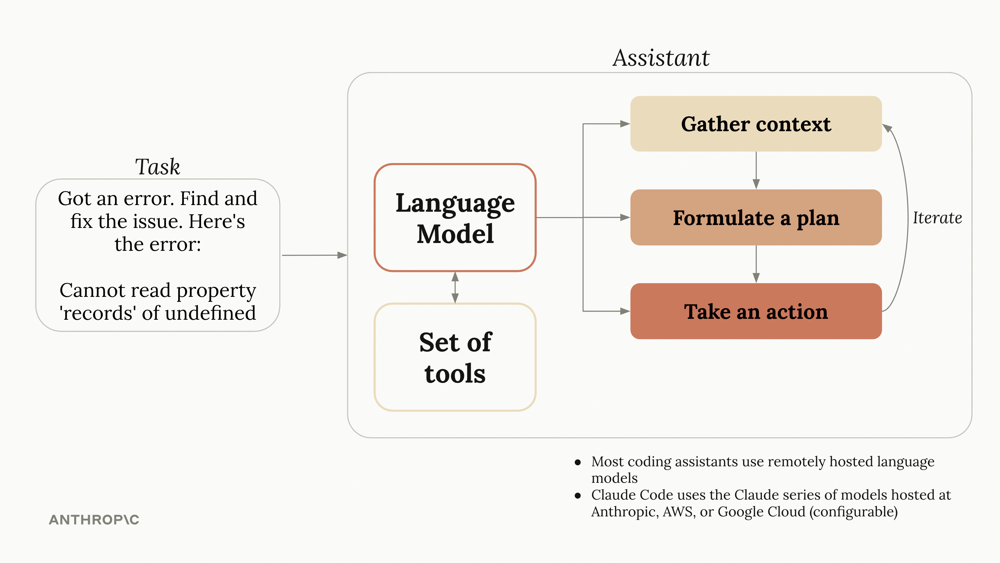

# Claude Code 快速入门

Claude Code 是 Anthropic 推出的命令行 AI 编程助手（Agent），能主动读写文件、执行命令、操作 Git，适合科研数据处理、代码开发和文档编写等场景。本章介绍其安装配置与使用方法。

## 使用须知

"推理"可以外包，"理解"不能。

AI 在给定框架内善于检索、推演和表述，但有两样东西它不具备。其一，你的研究情境：你清楚实验设计为什么选这个温度区间、论证机理时哪个特征峰最关键——AI 只能猜。其二，你的因果模型：你改过无数次实验条件，脑子里已经预演出参数调完曲线会怎么走、审稿人会从哪个角度质疑——AI 做不到。

这些缺口的反面，正是你的长板。数据拿到手上，你知道哪个峰异常、哪段曲线藏着机理，这不是靠检索，是靠反复实验积累的直觉。条件还没改，你已经能预判反应路径会怎么变。归根到底，什么课题值得投入、文章往哪个方向论证、结论对领域意味着什么——这是价值判断，不是逻辑推演。AI 在你画的框里跑得很快，但框只有你能画。

- **你画框，AI 跑**：给它明确的验收条件。图要什么风格、数据范围在哪、输出格式是什么。框画清楚了，它就出结果。
- **验证留给自己**：不让 AI 替你判断研究结论的合理性。让它验证自己的代码能不能跑通、数据范围是否符合预期，你省下时间做只有你能做的判断。
- **方向不外包**：选题、实验设计、论文论证逻辑，这些由你决定。AI 不知道你的研究意味着什么。

## 为什么 Claude Code 不只是聊天

ChatGPT 能回答问题、生成文字，但不能操作文件、不能执行命令。而Claude Code 是 Agent，它读完你的数据文件后能直接写脚本、运行、画图，报错了能自己查看错误日志并修正。这就是对话模型和 Agent 的本质区别：前者只能生成文本，后者能执行动作。

这一能力来源于工具调用。AI 不再只输出自然语言，还能输出结构化的操作指令：读取哪个文件、执行什么命令、调用哪个 API。当这些工具串在一起，AI 就从"参谋"变成了能做事的"副手"。

## 把个人经验变成团队资产

使用 AI 工具最大的浪费，是每个人都在从零开始教它同样的东西。Claude Code 提供了三种机制，让你的经验可以被复用：

- **`CLAUDE.md`**（详见[项目配置](./04-claude-md.md)）：放在项目根目录的配置文件，AI 启动时自动读取。写入代码风格、目录约定、画图规范，你写一次，团队所有人用的 AI 都能读到。AGENTS.md 是同类的项目上下文文件，让 AI 无需每次从零理解项目。
- **Skills**（详见[工具与扩展](./06-tools.md#skills)）：把重复性工作流固化。比如 TGA 数据处理的标准流程（读 CSV、归一化、提取特征温度、出图），写成一个 skill 文件放到 `.claude/skills/`，之后说一句"Process TGA data"就能按团队标准执行。换人不换结果。
- **MCP**（详见[工具与扩展](./06-tools.md#mcp)）：让 AI 连接到外部数据库、文献库或本地程序，直接查询数据而非描述数据。

## 越能做事，越要知道停

AI 执行能力越强，风险越大。几个具体做法：

- **小步提交，频繁审查**：AI 生成代码速度快，但正确性不随速度提升。每次变更后 `git diff` 审查，确认无误再提交，出问题果断回滚（详见[Git 协同](./05-git.md)）。
- **关键操作留人确认**：涉及远程推送、数据删除、批量修改时，不要让 AI 在无人监督下执行。Claude Code 的权限系统（`/permissions`）可以预设这类操作需要人工批准。
- **核心原则不变**："推理"可以外包，"理解"不能。你是那个知道实验设计为什么选这个温度区间、为什么用 TG 而不用 DTG 来定特征点的人。

关于 Agent 技术从对话模型到自主实体的完整演化历程，见 [附录 D：Agent 发展历程](./07-appendix.md#附录-dagent-发展历程)。

## 本章结构

- **安装与配置**：DeepSeek API 接入，Claude Code 安装与验证，VSCode 集成
- **基础使用**：启动、`/plan` 初体验、Prompt 写作技巧
- **常用命令**：斜杠命令速查、键盘快捷键
- **项目配置**：`CLAUDE.md` 三类配置文件的使用与编写
- **Git 协同**：自然语言 Git 操作
- **工具与扩展**：内置工具、Skills、MCP、Hooks、Subagents
- **参考与附录**：注意事项、命令速查表、Prompt 质量指南、Agent 发展历程、FAQ、Mac/Linux 提示

## 术语表

| 术语 | 含义 |
|------|------|
| **终端** | 命令行窗口，Windows 上为 `PowerShell` 或 `CMD`，按 Win⊞ 搜索 `powershell` 打开。 |
| **CLI** | 命令行界面，即终端里通过打字交互。Claude Code 本质上是 CLI 工具。 |
| **GUI** | 图形用户界面，即窗口按钮菜单。VSCode 扩展提供 GUI 方式使用 Claude Code。 |
| **~** | 用户目录简写，Windows 上即 `C:\Users\你的用户名`。 |
| **API Key** | 调用 API 的密钥。Claude Code 本身免费安装使用，通过 DeepSeek API Key 调用模型，API 按用量收费。 |
| **模型** | AI 的推理引擎。轻量模型便宜快速，适合简单任务；旗舰模型推理更深，适合复杂分析。可用 `/model` 切换。 |
| **Token** | AI 处理文本的最小单位，约 0.5 个中文字。API 按 token 计费。 |
| **Prompt** | 输入给 AI 的指令，质量直接决定输出。 |
| **上下文** | AI 能看到的对话历史和文件内容。 |
| **斜杠命令** | 以 / 开头的指令，如 `/plan` 先计划再执行、`/init` 生成项目配置。 |
| **Agent** | 能主动读写文件、执行命令的 AI。Claude Code 是 Agent，ChatGPT 网页是 ChatBot。 |
| **JSON** | 结构化文本格式，Claude Code 的配置文件都用它。 |
| **环境变量** | 系统级配置值。Windows 写 `$env:变量名`，Mac/Linux 写 `$变量名`。 |
| **Git** | 版本控制，记录每次修改、支持回退和多人协作。 |
| **VSCode** | 微软开源代码编辑器，装 Claude Code 扩展后可在编辑器内直接使用 AI。 |
